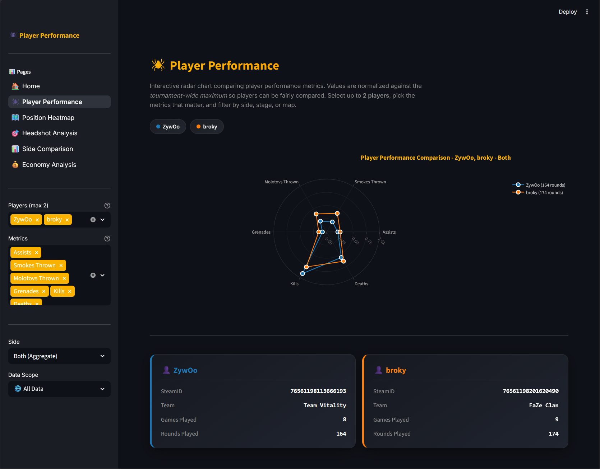
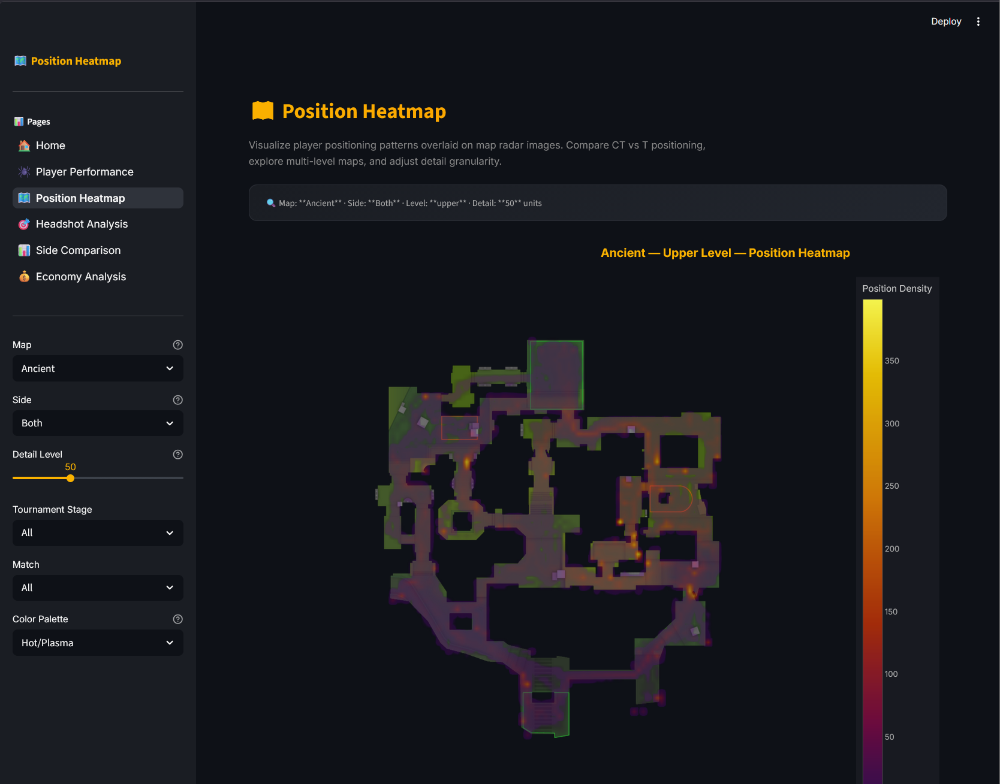
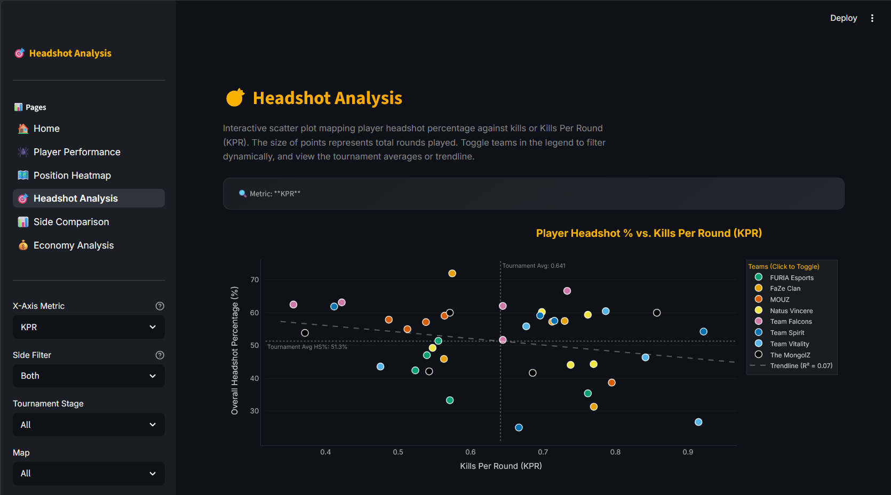
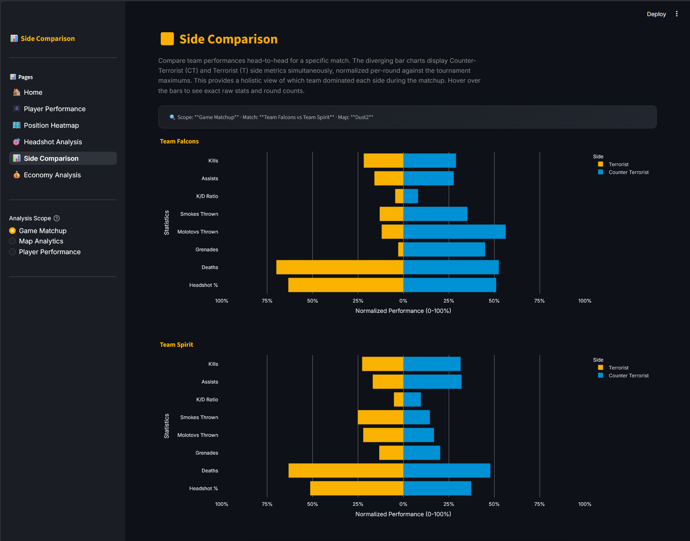
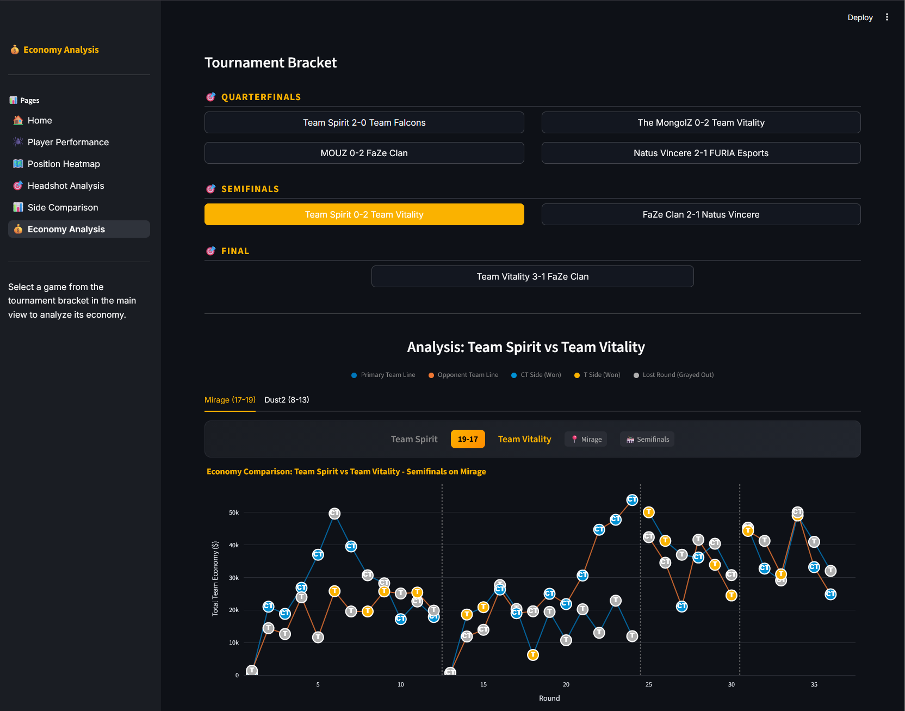

# Counter Strike, Budapest Major Tournament
A comprehensive data visualization project for analyzing professional CS:GO demo files. This project provides tools for parsing, processing, visualizing, and creating interactive dashboards from .dem files.

## Setup Instructions

1. **Python Version**: Ensure you have Python 3.12.4 installed.
2. **Install Requirements**: Run the following command to install the necessary dependencies:
   ```bash
   pip install -r requirements.txt
   ```
3. **Run Dashboard**: Launch the Streamlit dashboard from the main project directory:
   ```bash
   streamlit run src/dashboard/app.py
   ```

## Documentation

The project includes comprehensive documentation structured as follows:
- `docs/`: Contains high-level project overviews and general guides.
- `src/visualization/docs`: Contains individual documentation for each visualization component.
- `src/data_processing/docs`: Contains documentation outlining the data processing pipeline and methods.

## Evaluation Criteria
### Clarity of the research question / motivation and / or relevance (6)
> "Clarity of the research question / motivation and / or relevance"

The primary motivation for this project came from our interest in Counter-Strike 2 as a game and as enthusiasts who enjoy watching the professional scene. Regarding our research question, we wanted to explore different aspects of this complex game, including: The data captures the best players in the world competing at the highest level. These people spend countless hours mastering every aspect of the game, such as movement. As such, we wanted to explore patterns in player movement across different maps and stages of the tournament: Are there any interesting movement patterns that can be observed that indicate strategic decisions or positions? Additionally, we wanted to examine the relationship between headshot percentage and kills per round: What occurs as the number of kills increases? Does playing a specific side (Counter Terrorist or Terrorist) have an impact on team performance?

### Data mining (0-5)
> "will be 0 when downloading a structured dataset from a resource like Kaggle"

We started by sourcing our data directly from HLTV.org, where we downloaded the raw game files (`.dem` files) for each professional Counter-Strike 2 match. In total, these files amounted to more than 8GB of raw, unstructured data. These `.dem` files are incredibly dense and comprehensive—they capture absolutely every piece of information from a match, logging server ticks, precise player movements, weapon fires, economy changes, and grenade trajectories down to the millisecond. Because the files encode the complete state of the game at any given moment, the sheer volume of data is staggering, making it essential to know exactly what specific events and metrics we wanted to target and extract.

### Data cleaning (0-5)
> "will be 0 if no data transformation, imputation etc. was necessary"

Because the raw demo files are highly complex and contain a vast amount of event-based information, we had to parse and clean the data extensively. To make this large volume of data manageable for analysis and visualization, we split the extracted data into several distinct, structured datasets. This included parsing the data into specific categories such as player positions, economy states, match details, team outcomes, and weapon kills.

Here is a breakdown of the processed datasets we extracted from the `.dem` files:

| Dataset | Description | Generated File |
|---------|-------------|----------------|
| **Player Stats** | Per-player, per-side combat and utility statistics (Kills, Assists, Deaths, Headshots, Grenades). | `budapest_major_stats.csv` |
| **Match Details** | Per-team, per-side round win/loss details for each map. | `budapest_major_match_details.csv` |
| **Economy Data** | Each player's starting cash balance at the beginning of every round. | `budapest_major_economy.csv` |
| **Position Data** | Downsampled and binned player coordinate data for heatmap visualizations. | `budapest_major_positions.csv` |
| **Player Outcomes** | Per-player breakdown of round outcomes (won/lost) across each map. | `budapest_major_outcomes.csv` |
| **Team Outcomes** | Aggregated per-team round outcomes specifying which rounds were won on each map. | `budapest_major_team_outcomes.csv` |
| **Weapon Kills** | Detailed aggregation of kills categorized by the specific weapon used. | `budapest_major_weapon_kills.csv` |

For more detailed information regarding exactly what data was extracted and how the extraction was performed, please refer to the individual documentation files located in `src/data_processing/docs/`.

**Interesting Cleaning:** Processing the player position data was a particularly complex challenge. To handle the massive volume of positional coordinates logged at every server tick, we had to significantly downsample the data (e.g., from 128 ticks per second to 8 samples per second) and bin the exact X/Y coordinates into spatial grids. This transformation was essential to make generating the map heatmaps computationally feasible without overloading memory.

### Visualization design / infographics design (7-12)
> "will be a maximum of 7 points when using traditional charts (e.g., bar charts and scatterplots from a Python visualization library) in an appropriate, effective, and expressive way; can be higher when more thought went into the visual encoding (e.g., applying non-standard but interesting data transformations, a smart combination of different visual encodings, interesting infographic design, engaging and insightful use of animation, non-straight-forward visual encoding choice that leads to an interesting visual result, ...)"

Our dashboard utilizes several sophisticated, interactive Plotly visualizations designed to extract deep insights from the processed data. We went beyond traditional charts by applying non-standard data transformations and smart combinations of visual encodings:

1. **Player Performance Spider Chart** (`spider_player_performance.py`)
   - **Design**: A radar chart that allows for 1-2 player comparisons across multiple combat and utility metrics, normalized on a 0-100 scale.
   - **Advanced Encodings**: Incorporates custom data transformations, such as inverting the "Deaths" metric so that fewer deaths visually map to a higher (better) score on the polygon. It dynamically calculates norms from the global dataset to ensure consistent visual scaling regardless of how the user filters the data (by map, stage, or side).

2. **CT vs T Diverging Bar Chart** (`diverging_bar.py`)
   - **Design**: A side-by-side diverging bar chart that maps Terrorist (T) metrics to the negative (left) axis and Counter-Terrorist (CT) metrics to the positive (right) axis.
   - **Advanced Encodings**: This visualization instantly highlights side-specific imbalances. We applied non-standard visual adjustments, such as custom tick formatting to ensure the left-side axis reads as positive percentages, and custom hover templates that reverse the normalization to display the true raw context (e.g., actual Kills/Deaths) to the user.

3. **Position Density Heatmap** (`position_heatmap.py`)
   - **Design**: An interactive heatmap overlaying downsampled player position density directly onto high-resolution map radar images. 
   - **Advanced Encodings**: Uses custom game-to-pixel coordinate conversions to accurately map the binned player locations. It applies specific, interpolated colorscales based on the selected side (Blues for CT, Oranges/Golds for T) while rendering zero-density areas transparent so the underlying map geography remains visible.

4. **Team Economy Timeline** (`economy_viz.py`)
   - **Design**: A multi-series line chart detailing team economy progression across rounds, allowing simultaneous comparison of both teams with clear CT/T side markers.
   - **Advanced Encodings**: To prevent misleading visual connections, the line segments are strategically broken at match phase boundaries (e.g., halftime side swaps, overtimes). Round outcome markers are richly encoded with both the side played and the win/loss status using specific color themes, while automatically scaling axes based on actual data bounds.

5. **Headshot % vs Offensive Impact Scatter Plot** (`headshot_scatter.py`)
   - **Design**: An interactive bubble scatter plot mapping player Headshot Percentage against Kills Per Round (KPR).
   - **Advanced Encodings**: Incorporates an automated linear regression trendline with calculated R² statistics to quantify the strength of the correlation. The plot intelligently overlays dynamic tournament-wide average reference lines and utilizes centralized, team-specific colors (falling back to a colorblind-friendly palette) to reveal team clustering. Hover text uses rich HTML with emojis to seamlessly contextualize the deep statistics.

### Interaction design (0-10)
> "will be 0 when the visualizations are static, up to 5 points when using traditional interaction techniques like zooming or brushing and linking; can be higher for more interesting solutions (e.g., interesting semantic zooming solutions, non-standard but useful ways to query the data, ...)"

Because the entire dashboard is built using Streamlit and Plotly, every visualization is highly interactive by default. However, we went further to ensure the interactions are deeply tied to semantic querying and exploration:

1. **Rich Contextual Tooltips**: Instead of just displaying the plotted coordinates, hover states are customized with rich HTML and emojis to display deep contextual data. For example, hovering over a normalized bar in the diverging bar chart actually reverses the normalization to show the raw statistics (like actual Kills and Deaths).
2. **Semantic Data Querying**: Through the Streamlit sidebar, users can slice and dice the data dynamically. Users can instantly filter by tournament stage, specific maps, participating teams, individual players, and even isolate performance by side (CT vs T). The visualizations react and re-render instantly to these non-standard semantic queries.
3. **Legend Isolation and Brushing**: In charts with multiple series (like the headshot scatter plot or team economy timeline), clicking on a legend item (such as a specific team) instantly isolates or hides their data points. This acts as a linking mechanism to let users brush over and focus on specific team clusters.
4. **Deep Zooming and Panning**: For dense visualizations like the player position heatmaps or tightly clustered scatter plots, users can drag to zoom into specific map areas or data clusters, with axes auto-scaling to fit the new viewport.

### Implementation (0-10)
> "will be 0 when using standard visualization libraries, up to 5 points when intelligently using non-standard out-of-the-box solutions (e.g., parallelized data frames), but can be up to 10 points when tackling difficult implementation issues (e.g., scalability issues using approaches that cannot be tackled with out-of-the-box solutions, smart integration of model predictions)"

We constructed our visualizations using Plotly integrated natively into Streamlit. Rather than relying on simple out-of-the-box plotting, we tackled difficult visualization and implementation challenges:

1. **Complex Image Overlays**: For the Position Density Heatmap, we implemented a custom coordinate conversion algorithm to accurately map parsed in-game spatial coordinates directly onto authentic 1024x1024 high-resolution 2D map radar images. The heatmap density layer is superimposed precisely over these images, requiring specific scaling factors and inverted Y-axes depending on the map.
2. **Enhanced Visual Perception**: To enhance visual perception across dense charts like the Team Economy Timeline and Headshot Scatter Plot, we utilized non-standard configurations. This included integrating custom HTML elements and icons (emojis) natively into the Plotly traces and tooltips, alongside strict, side-specific color-coding to make statistical and contextual information instantly recognizable.
3. **Performance Optimization**: Since our scripts aggregated the 8GB of raw `.dem` files into lightweight CSVs, parallelized data frames (e.g., Dask) were unnecessary. Instead, we optimized scalability by implementing a centralized RAM caching strategy (`@st.cache_data` in `src/visualization/data_loader.py`) to eliminate redundant disk reads and ensure lightning-fast UI responsiveness.

### Question answering / conclusions / findings (~ analysis results) (7)
> "Question answering / conclusions / findings (~ analysis results)"

Through our visualizations, we uncovered several interesting insights about individual player performance, team performance, strategic player movements, and the impact of side (CT vs T). 

Combining the position heatmap with game knowledge, having both played Counter-Strike and having watched the Budapest Major, we observed clear areas on each map where players tended to cluster. This clustering is often an indication of utility (smokes, grenades, molotovs) being used to control specific areas or gain control of them. For example, on Ancient near the bottom right of the map there are several hotspots that are common utility usage spots. Other hotspots indicate common positions where players hold angles to halt enemy advances or to gain information. These patterns can be seen across the different maps and indicate team strategies regarding where players are likely to be at different stages of the game. My favorite example of the player position heatmap revealing player strategies is on the map Mirage, where on B site there is a clear pattern of players running and jumping in the same line to gain information about a specific corridor on the map; this is called "jumpsquatting".

Regarding the headshot analysis, it was interesting to see that there was a slight negative trend: as players got more kills, their headshot percentage tended to decrease. This is likely because, as players get more kills, they are more likely to be in high-pressure situations where they are taking more risky shots or playing against multiple opponents at once, which can lead to a lower headshot percentage. Furthermore, looking at the two players with the highest kills (donk and zywoo), it is apparent that zywoo has a significantly lower headshot percentage than donk. This can be explained using game knowledge: donk is an aggressive entry player who often plays with a rifle, requiring him to get headshots to be effective and not die immediately. On the other hand, Zywoo plays more with the AWP, a sniper rifle which is highly effective even when the body is hit, often resulting in a kill without the need for a headshot. This is likely why we see donk with a much higher headshot percentage than zywoo, even though they have similar kills per round. Additionally, it was also interesting to see that entire teams that had lower numbers of kills and headshot percentages, such as Furia, did not make it far in the tournament. 

The player performance spider chart reveals both individual player strengths and allows for comparison with other players. What we found interesting is that this highlighted the possibly different roles that these players take on. For example, comparing donk and Twistzz, it becomes apparent that Twistzz is more of a support player compared to donk; he has thrown significantly more grenades, molotovs, and smokes per round compared to donk. Whereas donk is known to be more of an aggressive entry player who is focused on getting kills, this is reflected in the spider chart where donk has a much higher kills per round than Twistzz, but Twistzz has a much higher utility usage per round than donk. This highlights how different players can have different roles and playstyles within the same team and how these roles can be reflected in their performance metrics. Additionally, it is interesting to see individual player performance and compare their CT against their T rounds to see differences between strategies. For example, Zywoo makes significantly more use of molotovs and grenades on CT side compared to T; this is likely to gain control of specific areas and halt enemy advances.

Building on the spider chart, the diverging bar chart provides insight into both team and individual player performance depending on whether they play on CT or T side. Depending on the team, we gain professional insights into their playstyles. For example, in one Team Falcons game, they used significantly more utility on CT side compared to their T side. However, interestingly, their opponent that game, Team Spirit, used more utility on T side compared to their CT side. This requires more investigation into why exactly, but it highlights important patterns in team strategies that offer interesting insights. By selecting Player Performance, we gain similar insights to the spider chart (individual player): we can compare a player's CT and T side based on a specific game, stage, or the entire tournament. 


## AI Usage

In this project, artificial intelligence was creatively leveraged and applied across several structured workflows to aid in development, documentation, and problem-solving. We utilized a diverse suite of models, including: Gemini 3.1 Pro [High, Low], Gemini 3.5 Flash [Low, Medium, High], Claude Sonnet 3.6, Claude Sonnet 4.6, Claude Opus 4.6, Qwen 3.6 Flash, and Mistral-medium-3.5.

To make the development process manageable for AI, we intentionally modularized the project. The overarching architecture was broken down into strictly independent components (Data Processing → Visualization → Dashboard) that were chained together without internal overlap. This modularity enabled several key AI workflows:

1. **Iterative Visualization Prototyping**: We created initial drafts outlining the precise features we wanted to present (e.g., for the spider chart). We provided these detailed descriptions to an AI model, which iteratively produced the visualization code.
2. **Dashboard Integration**: Once a standalone visualization script was fully complete and functioning, we engaged the AI model to seamlessly implement it into our interactive Streamlit dashboard.
3. **Deep Package Analysis**: We relied heavily on `awpy`, a package specifically designed for parsing Counter-Strike `.dem` files. Because its official documentation was sparse, we used a CLI-based AI model to read directly through the package's source code. This allowed us to quickly understand the underlying data extraction structures and identify the specific function calls necessary for our data cleaning pipeline.
4. **Granular Documentation Generation**: The project's documentation was drafted by AI through a granular, step-by-step process. Supplying the AI with highly localized context (e.g., one script at a time) ensured the generated documentation remained highly accurate and relevant to each individual module.

### Human Oversight

While we relied heavily on AI to write the underlying code for data processing and visualizations, the foundational concepts, research questions, and visualization designs were entirely conceptualized by our team. 

Because we understand that AI models are prone to mistakes and hallucinations, we implemented a rigorous, hands-on validation process to guarantee the absolute correctness of our outputs. Our team painstakingly verified every piece of AI-generated work—manually auditing the extracted data files, scrutinizing the mathematical logic within the visualization scripts, and thoroughly testing the interactive dashboard implementations. Whenever we identified logic flaws or code errors generated by the AI, we proactively stepped in to manually rewrite and correct them. This relentless human oversight and uncompromising quality control ensured that our final deliverable was completely accurate, highly reliable, and strictly aligned with our project goals.

## Preview of Project:

### Spider Visualization


### Heatmap Visualization


### Headshot Visualization


### Comparison Visualization


### Economy Visualization
